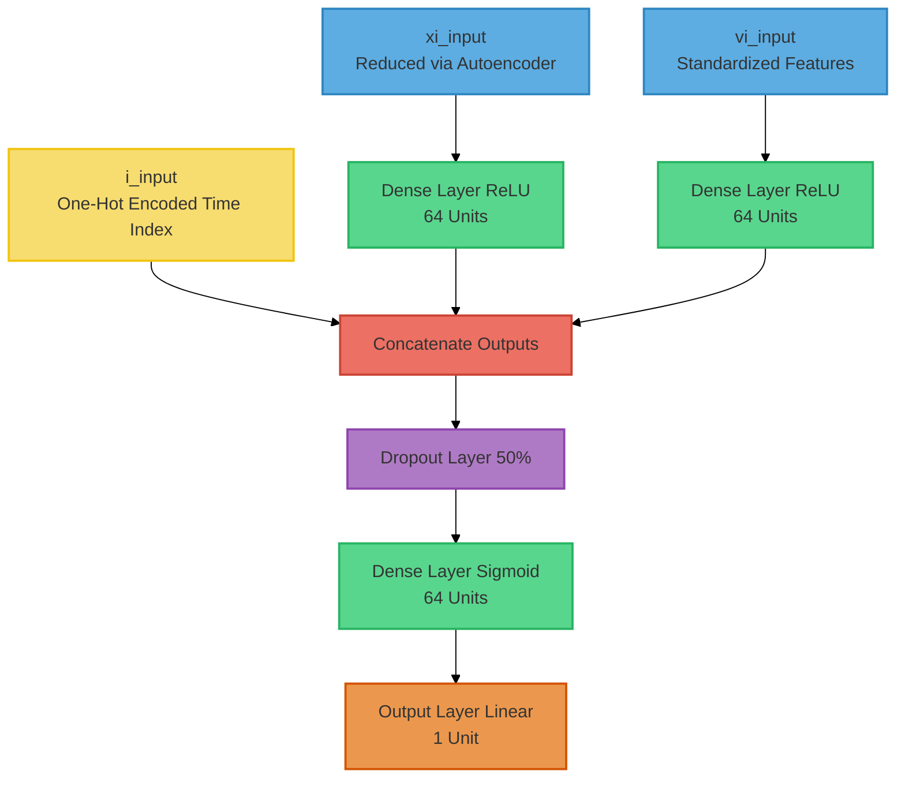

```mermaid
%%{init: {'theme': 'base', 'themeVariables': { 'background': '#ffffff' }}}%%
graph TD
    A[xi_input<br>Reduced via Autoencoder] --> B[Dense Layer ReLU<br>64 Units]
    C[i_input<br>One-Hot Encoded Time Index] --> D[Concatenate Outputs]
    E[vi_input<br>Standardized Features] --> F[Dense Layer ReLU<br>64 Units]
    
    B --> D
    F --> D
    
    D --> G[Dropout Layer 50%]
    G --> H[Dense Layer Sigmoid<br>64 Units]
    H --> I[Output Layer Linear<br>1 Unit]
    
    style A fill:#5DADE2,stroke:#2E86C1,stroke-width:2px
    style B fill:#58D68D,stroke:#28B463,stroke-width:2px
    style C fill:#F7DC6F,stroke:#F1C40F,stroke-width:2px
    style D fill:#EC7063,stroke:#CB4335,stroke-width:2px
    style E fill:#5DADE2,stroke:#2E86C1,stroke-width:2px
    style F fill:#58D68D,stroke:#28B463,stroke-width:2px
    style G fill:#AF7AC5,stroke:#8E44AD,stroke-width:2px
    style H fill:#58D68D,stroke:#28B463,stroke-width:2px
    style I fill:#EB984E,stroke:#D35400,stroke-width:2px
```
